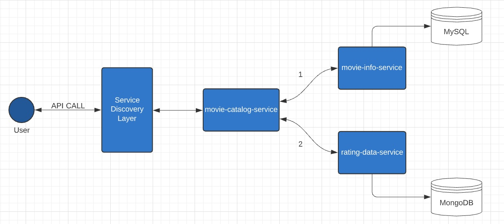

Movie Rating Catalog
=========

APIs
-----
You are provided an external API endpoint where you can query movie rating details by providing the movie name.

Example HTTP calls

```
http://localhost:7000/catalog/Interstellar
http://localhost:7000/catalog/Shawshank
```

Task
----

Design an application which would take in a name of a movie and return the rating of the movie (out of 5).

#### Requirements

- The rating value must be rounded to **2** decimal places
- The endpoint response **must** be `JSON` encoded.
- The application should be stateless, i.e. it is **not allowed** to cache the recipe response on the application side.


##### Use Case #1 - Search movie by providing complete movie name

The user should be able to retrieve the rating of the specific movie on providing the complete name of the movie.

_Specific requirements_
- The endpoint **must** be able to fetch the movie with specific name as povided.
- The rating will be shown with **2 decimal points.**
- The solution should operate under the assumption that the source API contains an unlimited number of movies.

_Responses_
- `200 Ok` : If the the request returns a success response
- `404 Not Found` : If the movie name searched is not present in the database
- `500 Internal Server Error` : If any error occurs during processing. Reponded with proper error message.

Example: `GET http://localhost:7000/catalog/Interstellar`

```json
{
    "userRatings": [
        {
            "movieId": "1.0",
            "movieName": "Interstellar",
            "rating": [5.0, 4.0, 3.0, 5.0, 5.0, 5.0, 5.0, 4.0, 5.0, 4.0, 5.0, 4.0, 5.0, 5.0, 5.0, 5.0, 5.0, 5.0, 3.0],
            "avgRating": 4.58
        }
    ]
}
```

##### Use Case #2 - Search movie by providing partial movie name

The user should be able to retrieve the rating of the all the movies that matches with the partial movie name provided.

_Specific requirements_
- The endpoint **must** be able to fetch all the movies with partial name as povided.
- The rating will be shown with **2 decimal points.**
- The solution should operate under the assumption that the source API contains an unlimited number of movies.

_Responses_
- `200 Ok` : If the the request returns a success response
- `404 Not Found` : If the movie name searched is not present in the database
- `500 Internal Server Error` : If any error occurs during processing. Reponded with proper error message.

Example: `GET http://localhost:7000/catalog/tion`

```json
{
    "userRatings": [
        {
            "movieId": "2.0",
            "movieName": "Inception",
            "rating": [2.0, 5.0, 3.0, 2.0, 3.0, 4.0, 4.0, 4.0, 4.0, 5.0, 5.0, 4.0, 4.0, 2.0, 3.0, 2.0],
            "avgRating": 3.5
        },
        {
            "movieId": "3.0",
            "movieName": "Shawshank Redemption",
            "rating": [5.0, 5.0, 5.0, 5.0, 5.0, 5.0, 5.0, 5.0, 5.0, 5.0, 5.0, 5.0, 5.0, 4.0, 4.0, 4.0, 4.0, 4.0, 4.0, 4.0, 5.0, 5.0, 5.0, 5.0, 5.0, 5.0, 5.0, 5.0, 5.0, 5.0, 5.0,                       4.0],
            "avgRating": 4.75
        },
        {
            "movieId": "5.0",
            "movieName": "Pulp Fiction",
            "rating": [5.0, 4.0, 5.0, 4.0, 5.0, 5.0, 5.0, 5.0, 5.0, 5.0, 5.0, 5.0, 4.0, 4.0, 4.0, 4.0, 5.0, 4.0, 5.0, 5.0, 5.0, 5.0, 5.0, 5.0],
            "avgRating": 4.71
        }
    ]
}
```

Solution
----

#### Endpoint GET "http://localhost:7000/catalog/Interstellar"
- Call the movie-info-service mocriservice internal API to collect all the movie with the provided name from its own MySQL database.
- On getting the list of names from the movie-info-service microservice, call the rating-data-service microservice internal API with the movie names to get their rating details.
- The rating-data-service microservice has it's own MongoDB Database where it stores all the rating informations.
- On getting the rating details be paring through the movie list and calculate the average rating upto 2 decimal places.
- Return the data in JSON format in case of success
- Return and Error JSON with error code and message on failure
- The movie-info-service and rating-data-service microservices are hosted via `Spring Cloud Eureka Service Discovery`


Architecture/ Code structure
----

The code structure for the project has it's motivation in Uncle Bob's Clean Architecture.

#### It tries to follow the following principles
- Independence from Frameworks - The architecture does not depend on the existence of some library. Databases/UI frameworks can be swapped easily. Business logic is independent of DB or style of exposure.
- Separation of concerns - Layers of architecture should be such that business concerns, delivery concerns and storage concerns are not intermixed.
- Individual Testable components - The business logic can be tested separately.

#### 4 layered architecture
- Models - Stores the structures of data. Can be utilized in any layer.
- Repository - This layer is responsible for CRUD operations, whether from DB or another service. No business logic.
- Business Logic - This layer will act as the business process handler. It decides and uses Repository layer accordingly.
- Controller - This acts as the presenter to the outer world. Contacts Usecase layer to respond to API calls.




